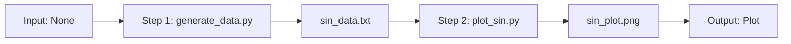

# Product Context

## Why This Project Exists

This project serves as an educational and practical example of how to create reproducible scientific workflows using REANA (Reproducible Analysis). It demonstrates the fundamental concepts of:

1. **Data Processing Automation**: Automatically generating scientific data (sine wave) without manual intervention
2. **Visualization Pipeline**: Transforming raw data into publication-quality plots
3. **Containerized Execution**: Ensuring consistent results across different environments

## Problems It Solves

- **Reproducibility Crisis**: Scientific computations often fail to reproduce due to environment differences
- **Manual Process Overhead**: Eliminates manual data generation and plotting steps
- **Documentation Gap**: Provides a complete, documented example for learning REANA

## How It Should Work

## User Experience Goals

1. **Simple Execution**: Single command to run the entire workflow
2. **Clear Documentation**: README explains everything from setup to results
3. **Immediate Feedback**: Validation command checks configuration before running
4. **Easy Debugging**: Status and logs commands help troubleshoot issues

## Intended Users

- Scientists learning REANA
- Researchers needing reproducible data processing
- Students studying scientific workflows
- Developers building similar pipelines
